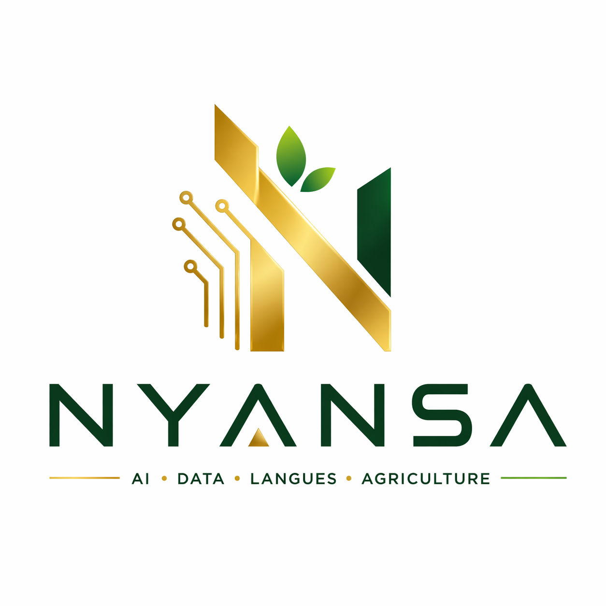

# nyansa | African Language & Agri-Tech AI Data



**nyansa** is a high-performance data science platform dedicated to bridging the gap between African linguistic diversity and global AI innovation. We specialize in sourcing, annotating, and delivering high-precision datasets for low-resource languages and precision agriculture.

## 🚀 Vision
To empower inclusive AI models by providing the ground-truth data necessary to understand the language of the farmer and the complexities of African agricultural ecosystems.

## 🛠️ Technology Stack

### Frontend
- **Framework**: React 18 with Vite
- **Language**: TypeScript
- **State Management**: React Hooks
- **Styling**: Vanilla CSS with modern Design Tokens
- **Localization**: i18next (English & French)
- **Visualization**: Recharts (Interactive Admin Dashboards)
- **SEO**: React Helmet Async

### Backend
- **Framework**: Django & Django REST Framework
- **Database**: PostgreSQL (configured for production)
- **API**: RESTful architecture
- **Security**: JWT Authentication & GDPR-compliant data handling

## ✨ Key Features

- **Multimodal Dataset Catalog**: Browse and filter datasets by language, type (Text, Audio, Image), and agricultural sector.
- **Precision Agriculture Ecosystem**: Deep mapping of crops like Cacao, Coffee, and Yam with expert-verified diagnostic data.
- **Language Inclusivity**: Specialized support for low-resource dialects including Swahili, Wolof, Akan, and Dioula.
- **Admin Console**: Real-time monitoring of project requests, expert management, and data pipeline metrics.
- **GDPR Compliant**: Built-in data protection and user rights management.

## 📦 Project Structure

```text
.
├── backend/            # Django REST API
│   ├── core/           # Main business logic & models
│   ├── datasets/       # Dataset management
│   ├── contact/        # Contact & Project request system
│   └── seed_data.py    # Initial database population script
├── frontend/           # React SPA
│   ├── src/
│   │   ├── components/ # Reusable UI components
│   │   ├── pages/      # Route-level components
│   │   ├── locales/    # i18n translation files
│   │   └── assets/     # Images & Logos
└── README.md
```

## ⚙️ Installation & Setup

### Prerequisites
- Python 3.9+
- Node.js 18+
- PostgreSQL

### Backend Setup
1. Navigate to `backend/`
2. Create and activate a virtual environment:
   ```bash
   python -m venv venv
   source venv/bin/activate  # or venv\Scripts\activate on Windows
   ```
3. Install dependencies:
   ```bash
   pip install -r requirements.txt
   ```
4. Run migrations and seed data:
   ```bash
   python manage.py migrate
   python seed_data.py
   ```
5. Start the server:
   ```bash
   python manage.py runserver
   ```

### Frontend Setup
1. Navigate to `frontend/`
2. Install dependencies:
   ```bash
   npm install
   ```
3. Start the development server:
   ```bash
   npm run dev
   ```

## 📄 License
This project is proprietary and confidential.

---
*Built with ❤️ in Côte d'Ivoire for the future of African Agriculture.*
